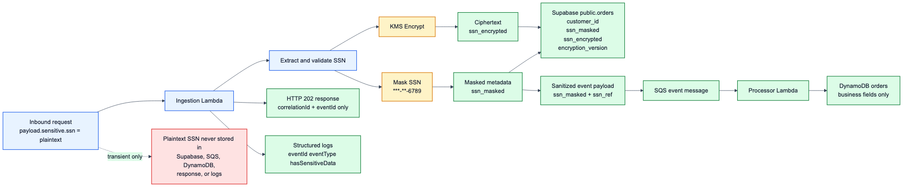
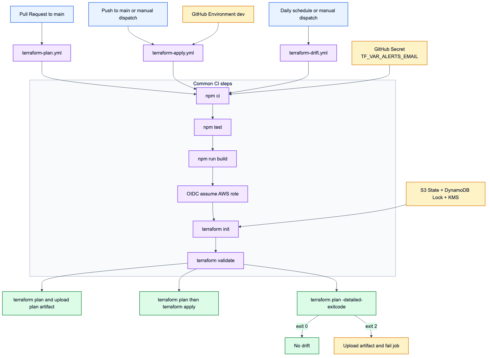

# Event-Driven Observability Platform

Serverless event-driven platform on AWS for ingesting order events, processing them asynchronously, handling retries and duplicates, and exposing operational visibility through CloudWatch dashboards, alarms, structured logs, and runbooks.

This project is intentionally focused on practical cloud engineering: reliable async processing, idempotency, DLQ handling, least-privilege IAM, and incident-oriented observability.

## Architecture


Mermaid source: [assets/architecture.mmd](/Users/eltonpeixoto/dev/event-driven-observability-platform/assets/architecture.mmd:1)

- **API Gateway HTTP API** exposes the event ingestion endpoint.
- **Ingestion Lambda** validates incoming events, adds correlation metadata, emits EMF metrics, and sends accepted events to SQS.
- **SQS queue + DLQ** decouple ingestion from processing and isolate messages that exceed retry limits.
- **Processor Lambda** consumes SQS messages, applies idempotency, persists processed events, and reports partial batch failures.
- **DynamoDB** stores idempotency keys and processed order records.
- **CloudWatch + SNS** provide logs, metrics, dashboards, alarms, and alert notifications.
- **Cognito JWT authorizer** protects the ingestion API with client credentials flow.

## Key Engineering Decisions

- **SQS with DLQ:** asynchronous processing, retry isolation, and safer failure handling.
- **DynamoDB idempotency:** duplicated events are detected in the processor and skipped without duplicated downstream effects.
- **Partial batch failure handling:** failed SQS records can be retried without replaying the whole batch.
- **CloudWatch EMF metrics:** application events are emitted as structured metrics such as `EventIngested`, `EventProcessed`, `EventRejected`, `EventDuplicated`, and `EventRetried`.
- **Unresolved Events metric:** tracks accepted event messages without a terminal processing outcome:

  ```text
  UnresolvedEvents = Ingested - Processed - Rejected - Duplicated
  ```

  `EventRetried` is intentionally not subtracted because retries are intermediate attempts, not final outcomes.

- **DLQ depth as separate operational signal:** DLQ backlog is monitored with SQS metrics and not mixed into historical event-outcome math.
- **Least-privilege IAM:** ingestion and processor Lambdas use separate execution roles with permissions scoped to their responsibilities.

## Observability

The CloudWatch dashboard focuses on service health, event flow, queue health, error signals, DLQ visibility, and alarm status.

Main signals:

- API 4xx/5xx responses from API Gateway access logs.
- Lambda duration, errors, throttles, and concurrency.
- SQS queue depth, queue age, and DLQ depth.
- DynamoDB user/system errors and write throttles.
- Custom EMF metrics for event lifecycle tracking.
- Alarm status and SNS notifications.

DLQ depth represents the current backlog of failed messages waiting for investigation or replay. A future DLQ observer could emit `EventDeadLettered`, but this is not implemented yet.

## Incident Scenarios

Operational scenarios are documented with incident notes, runbooks, and screenshots:

| Scenario          | Incident                                                                   | Runbook                                                                  |
| ----------------- | -------------------------------------------------------------------------- | ------------------------------------------------------------------------ |
| Schema violation  | [docs/incidents/schema-violation.md](docs/incidents/schema-violation.md)   | [docs/runbooks/schema-violation.md](docs/runbooks/schema-violation.md)   |
| Ingestion failure | [docs/incidents/ingestion-failure.md](docs/incidents/ingestion-failure.md) | [docs/runbooks/ingestion-failure.md](docs/runbooks/ingestion-failure.md) |
| Duplicated event  | [docs/incidents/duplicated-event.md](docs/incidents/duplicated-event.md)   | [docs/runbooks/duplicated-event.md](docs/runbooks/duplicated-event.md)   |
| DLQ incident      | [docs/incidents/dlq-incident.md](docs/incidents/dlq-incident.md)           | [docs/runbooks/dlq-incident.md](docs/runbooks/dlq-incident.md)           |

There is also a sample postmortem for the DLQ scenario: [docs/postmortems/dlq-incident.md](docs/postmortems/dlq-incident.md).

## Repository Structure

```text
infra/envs/dev/      Terraform AWS infrastructure
services/ingestion/  API ingestion Lambda
services/processor/  SQS processor Lambda
services/shared/     Structured logging and EMF metrics
docs/                Incidents, runbooks, and postmortem
scripts/             Build and load-test helpers
assets/              Evidence screenshots
```

## Requirements

- Node.js
- Terraform 1.5+
- AWS CLI configured with credentials for the target AWS account
- An email address for SNS alert subscription confirmation

## Build

Install root dependencies and package the Lambda artifacts:

```bash
npm install
npm run build
```

The build script bundles the Lambda handlers and creates deployment zips under `artifacts/`.

## Configuration

Create a local Terraform variables file from the safe example:

```bash
cp infra/envs/dev/terraform.tfvars.example infra/envs/dev/terraform.tfvars
```

Then edit `infra/envs/dev/terraform.tfvars`:

```hcl
environment  = "dev"
alerts_email = "your-email@example.com"
```

The real `terraform.tfvars` file is intentionally ignored by Git.

## Supabase Secret Setup

This lab uses Supabase REST for `public.orders`, but the real service role key must stay outside Git, Terraform code, Terraform outputs, Lambda plaintext env vars, and test payloads.

Terraform creates only the Secrets Manager secret container:

```hcl
resource "aws_secretsmanager_secret" "supabase" {
  name        = "${var.environment}/orders/supabase"
  description = "Supabase credentials for orders lab"
}
```

After `terraform apply`, populate the secret value manually through AWS CLI, console, or a secure pipeline. Do not create a version with the real value in versioned Terraform.

Suggested secret JSON:

```json
{
  "SUPABASE_REST_URL": "https://bfeydmouleklgysiugtn.supabase.co/rest/v1/",
  "SUPABASE_DATABASE": "orders",
  "SUPABASE_SERVICE_ROLE_KEY": "<set-manually-outside-git>"
}
```

Example AWS CLI flow after the secret container exists:

```bash
aws secretsmanager put-secret-value \
  --secret-id dev/orders/supabase \
  --secret-string '{"SUPABASE_REST_URL":"https://bfeydmouleklgysiugtn.supabase.co/rest/v1/","SUPABASE_DATABASE":"orders","SUPABASE_SERVICE_ROLE_KEY":"<set-manually>"}'
```

Both Lambdas load the secret at runtime from Secrets Manager. The only Supabase-related env var passed to code is `SUPABASE_SECRET_ARN`.

## Sensitive Data Flow



Mermaid source: [assets/sensitive-flow.mmd](/Users/eltonpeixoto/dev/event-driven-observability-platform/assets/sensitive-flow.mmd:1)

- Plaintext SSN exists only inside the inbound request and in-memory handling inside the ingestion Lambda.
- The ingestion Lambda encrypts the SSN with AWS KMS immediately.
- Supabase stores only `ssn_masked`, `ssn_encrypted`, and `encryption_version`.
- The event published to SQS contains only masked metadata (`ssn_masked`, `ssn_ref`).
- DynamoDB stores business data only, without SSN plaintext or ciphertext fields.
- Logs and HTTP responses expose correlation metadata, not the SSN plaintext.

## Deploy

```bash
cd infra/envs/dev
cp ../../bootstrap/cicd/backend.hcl.example backend.hcl
terraform init -backend-config=backend.hcl
terraform validate
terraform apply
```

After applying, confirm the SNS email subscription and use the API Gateway invoke URL for test requests to `POST /events`. The route is protected by the Cognito JWT authorizer, so requests must include a valid bearer token.

The Terraform output includes a CloudWatch dashboard URL:

```bash
terraform output dashboard_url
```

## CI/CD

GitHub Actions now uses AWS OIDC with short-lived credentials and the remote Terraform backend created by `infra/bootstrap/cicd`.

- Pull requests to `main` run `.github/workflows/terraform-plan.yml` with the plan role.
- Pushes to `main` and manual dispatch run `.github/workflows/terraform-apply.yml` with the apply role.
- `.github/workflows/terraform-drift.yml` runs on a daily schedule and fails if `terraform plan -detailed-exitcode` finds drift in `infra/envs/dev`.
- Both workflows rebuild the Lambda deployment artifacts before `terraform plan` or `terraform apply`.
- The CI pipeline runs `npm test` before building artifacts, covering Lambda ingestion, Lambda processing, and safe log redaction behavior with mocked AWS/Supabase dependencies.
- `alerts_email` is injected through the GitHub secret `TF_VAR_ALERTS_EMAIL`, so the workflows can plan/apply without hardcoding operational values in the repository.
- The apply workflow targets the GitHub `dev` environment, so you can add required reviewers or wait timers in repository settings without changing code.

### CI/CD Today



Mermaid source: [assets/cicd-current.mmd](/Users/eltonpeixoto/dev/event-driven-observability-platform/assets/cicd-current.mmd:1)

- `terraform-plan.yml`: runs on PRs to `main`, produces the plan artifact, and never applies.
- `terraform-apply.yml`: runs on `main` push or manual dispatch, uses the GitHub `dev` environment, and applies the approved plan path.
- `terraform-drift.yml`: runs daily and on demand, and fails if `terraform plan -detailed-exitcode` detects drift.
- All three workflows now pass through `npm ci`, `npm test`, `npm run build`, OIDC, `terraform init`, and `terraform validate`.

## Example Event

```json
{
  "eventId": "evt-001",
  "eventName": "Order Created",
  "eventType": "OrderCreated",
  "payload": {
    "order_id": "order_001",
    "customer_id": 1001,
    "amount": 149.9,
    "currency": "USD",
    "sensitive": {
      "ssn": "<provided-at-request-time>"
    }
  }
}
```

The ingestion Lambda immediately encrypts the SSN with AWS KMS, stores only ciphertext plus masked metadata in Supabase, and publishes a sanitized event to SQS:

```json
{
  "eventId": "evt-001",
  "eventName": "Order Created",
  "eventType": "OrderCreated",
  "payload": {
    "order_id": "order_001",
    "customer_id": "customer_001",
    "amount": 149.9,
    "currency": "USD",
    "sensitive": {
      "ssn_masked": "***-**-6789",
      "ssn_ref": 1001
    }
  }
}
```

## Testing Scenarios

- **Valid event:** send a valid authenticated payload to `POST /events` and confirm `EventIngested` and `EventProcessed`.
- **Schema violation:** send a payload missing `eventId` or `eventType`; see the [schema violation runbook](docs/runbooks/schema-violation.md).
- **Duplicated event:** send the same `eventId` twice; see the [duplicated event runbook](docs/runbooks/duplicated-event.md).
- **Ingestion failure:** send a payload with `forceIngestionFailure: true`; see the [ingestion failure runbook](docs/runbooks/ingestion-failure.md).
- **DLQ incident:** send or enqueue an event with `failTransient: true`; see the [DLQ incident runbook](docs/runbooks/dlq-incident.md).

## Limitations And Future Improvements

- Unit tests cover ingestion, processor, and safe log redaction paths, but broader integration and end-to-end tests are still not implemented.
- A future DLQ observer could emit `EventDeadLettered` while preserving replay/investigation semantics.
- The current environment is a single dev deployment, not a multi-environment production module.
- Some operational scenarios are intentionally simulated to demonstrate observability and incident response.

## Security And Cost Notes

- IAM roles are scoped by Lambda responsibility.
- Terraform variables avoid committing personal alert endpoints.
- Supabase secrets stay in AWS Secrets Manager; the real service role key is never committed, logged, sent to SQS, or exposed in Terraform outputs.
- `public.orders` stores only masked metadata and KMS ciphertext. Plaintext SSNs are discarded immediately after encryption.
- In the validated lab dataset, `customer_id` is a numeric identifier for the Supabase-sensitive record flow.
- DynamoDB uses on-demand billing for the dev environment.
- CloudWatch dashboards, alarms, logs, and custom metrics can generate cost; clean up resources when no longer needed.

## Cleanup

Review the Terraform-managed resources before cleanup. When the environment is no longer needed, remove it through Terraform from `infra/envs/dev`.
